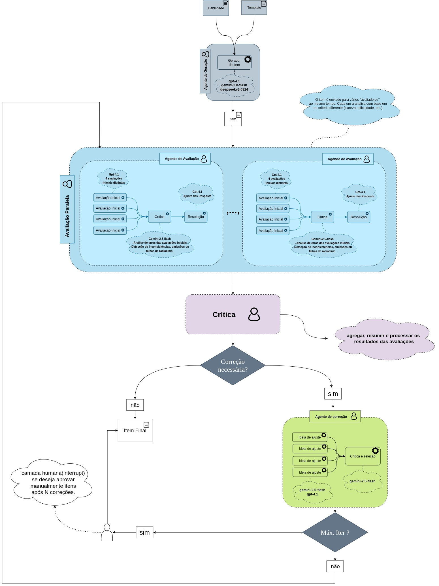

-> **Tags:** #Agentes #AIG
## Agentes
[Link para o Repositorio](https://github.com/joaoaugustopc/AIG_SMA)
O sistema conta com três principais de agentes:
### Gerador 
Implementado em `src/generator.py`, o agente gerador utiliza um modelo de linguagem definido no arquivo ``conf/config.yaml``  para criar um item de avaliação com base nas variáveis obtidas dos csv's ```data/especificacao_tarefa_exemplo.csv``` e ```data/matriz_lp.csv``` .
- As variáveis incluem código da habilidade, descritor, etc. (`get_variables`).
- Utiliza um prompt `system + human` que orienta o modelo sobre o tipo de item a ser gerado. (Definido em ``conf/config.yaml``)
- A função `generate_item()` retorna o item bruto como `str`, armazenado no campo `draft` do estado compartilhado.
### Avaliador 
Cada critério de avaliação (ex: critérios do comando, plausibilidade...) tem um avaliador específico implementado em `evaluator.py`, utilizando:

- Um prompt configurável em  ``conf/config.yaml``para avaliação.
- Um agente LLM que executa as etapas de ideação → crítica → resolução (SmartLLMChain).
- A função `build_all_chains(cfg)` instancia todos os avaliadores de cada critério.

O retorno de cada avaliador é um JSON com campos `"status"` e `"comentario"`, tratados e normalizados pela função `safe_json_load` que está no arquivo ```utils/json_utils.py```.
### Corretor
O agente corretor (em `corrector.py`) atua apenas quando há erros detectados na avaliação. Ele recebe:
- O item gerado.
- Um feedback consolidado com todos os comentários dos avaliadores que indicaram erro.
Usa o mesmo modelo `SmartLLMChain`, com prompt próprio e três etapas LLM. A saída corrigida substitui o item anterior, reiniciando o ciclo de avaliação.

## Grafo de Estados 

A lógica do sistema é organizada com base em um grafo de estados construído usando a biblioteca `langgraph`. O estado principal (`ItemState`) armazena:
- `draft`: item gerado ou corrigido.
- `eval_results`: lista de dicionários com resultados dos avaliadores.
- `errors`: lista de comentários de erro (caso existam) para serem passados como feedback para o agente corretor.
- `iter_count`: contador de iterações realizadas.

O fluxo do grafo é:

1. **generate** → gera um novo item.
2. **eval_*** → cada critério de avaliação é executado em paralelo.
3. **aggregate** → coleta os erros (status = "ERRO").
4. **decision**:
    - Se **sem erros** ou **número máximo de iterações atingido**, o processo termina (`END`).
    - Caso contrário, envia para o nó de correção (`correction`).
5. **correction** → corrige o item com base nos erros e reinicia o ciclo a partir dos avaliadores.
Esse ciclo permite o refinamento progressivo do item até que atenda a todos os critérios estabelecidos.

=> Diagrama que representa o SMA: 




Ps.: A camada humana ainda não foi implementada, ainda esta no campo das idéias. 

[Testes_SMA](AIG/Testes_SMA)
